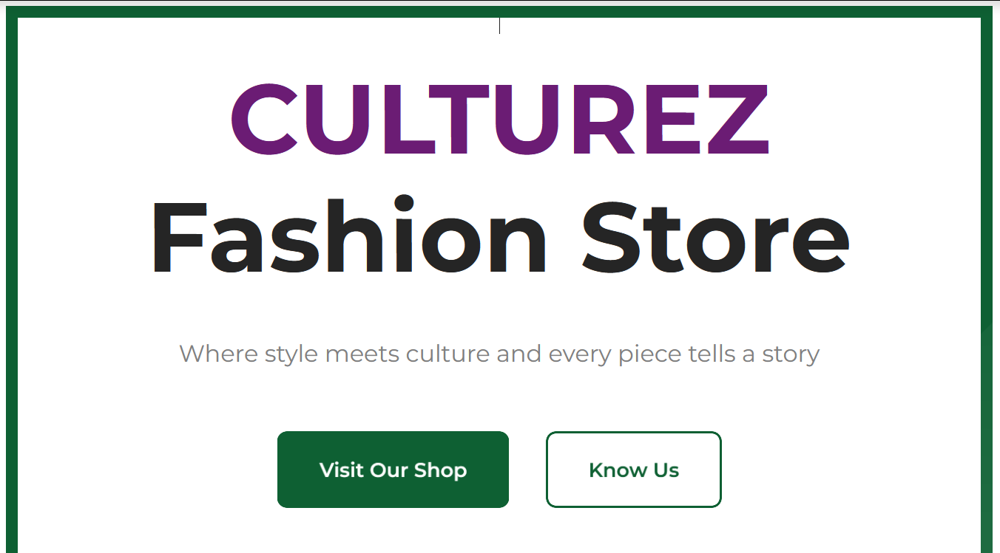

# CULTUREZ FASHION STORE



---

# Project Description

This Culturez project is a professional website showcasing a premium fashion brand that blends urban culture with contemporary style. The platform serves as a digital hub for the brand, featuring product collections, lookbooks, brand story, and company details.

Built as a modern single-page application using React, the website offers smooth navigation and responsive design to accommodate visitors across all device types. Key features include product showcases, collection galleries, shopping functionality, and informational pages about the brand.

---

## Technologies Used

- **Frontend**: React.js, React Router
- **Styling**: CSS with custom properties (CSS variables)
- **Icons**: React Icons (Font Awesome)
- **Build Tool**: Vite

---

## Features

- Responsive design for all screen sizes
- Smooth page transitions and scroll behaviors
- Product collections and lookbooks
- Shopping cart functionality
- Brand story and philosophy
- Contact forms and company information
- Back-to-top and scroll restoration functionality

---

## Installation

To set up this project locally, follow these steps:

- **Clone the repository**:

```bash
git clone https://github.com/IamLRBA/tizzy-camp-music.git
cd tizzy-camp-music
```

- **Install dependencies**:

```bash
npm install
```

- **Start the development server**:

```bash
npm run dev
```

- Open your browser to http://localhost:3000 to view the application.

---

## Project Structure

src/
├── components/       # Reusable UI components
├── pages/            # Page components
├── routes/           # Application routing
├── styles/           # Global styles and CSS variables
├── App.jsx           # Main application component
└── main.jsx          # Application entry point

---

## Available Scripts

- **npm run dev**: Starts the development server
- **npm run build**: Builds the application for production
- **npm run lint**: Runs ESLint for code quality checking
- **npm run preview**: Previews the production build locally

---

## Deployment

The application is deployed using Vercel and is automatically deployed when changes are pushed to the main branch.

---

## Contributing

Contributions are welcome. Please open an issue to discuss proposed changes before submitting a pull request.

---

## License

This project is proprietary software owned by Culturez®. All rights reserved.